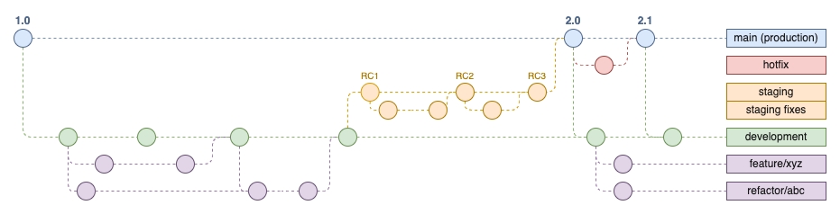

# LB-ATS

## Setup
To get started with the repository, follow these steps:

### Clone the Repository
Fork and clone the repository to your local machine:
```
git clone https://github.com/LifeBonder-App/lifebonder-website.git
```

### Basic Git Commands
Familiarize yourself with these common Git commands for effective version control:

Check Status: Check the status of files in your local repository.
```
git status
```
Create New Branch: Create new branch where changes can be safely made.
```
git checkout -b <branch-name>
```
Add Changes: Stage your changes for commit.
```
git add .
```
Commit: Commit your staged changes with a meaningful message.
```
git commit -m "Descriptive commit message"
```
Push: Push your commits to the remote repository.
```
git push origin branch-name
```

## Contributing

To contribute effectively, please follow these guidelines:

**Consistency**: Adhere to the existing code style and conventions.

**Comments**: Use comments to explain complex code and logic.

**Avoid Duplication**: Follow the DRY (Don't Repeat Yourself) principle.

**Modular Code**: In line with the previous point of avoiding duplication point, structure your code into reusable functions or components.

**Branch Management**: 
We use a structured branching strategy to manage contributions and development:

- **Main**: The production branch that reflects the live site. Only stable and approved changes are merged here from the staging branch.

- **Staging**: The staging branch for pre-production testing. Features and fixes are merged here before going live.

- **Development**: The working branch where new features and updates are added. All development work happens here.

- ***Branch Conventions***: 
    - All work should be done on a new branch. 
    - **DO NOT** make changes directly to the `main`, `staging`, or `development` branches. 
    - Create a new branch from `development` and make changes on that new branch.
    - Create Pull Request from your branch to `development`.

When creating new branches, use the following pattern of `category-prefix/description`:

Feature: feature/new-feature-name

Bug Fix: fix/bug-description

Documentation: docs/description

Style: style/description

Refactor: refactor/description

#### Examples: 

Create a new branch based on the development branch using the appropriate prefix, note that your username should come at the front of the branch name (see below linear docs):
```
git checkout -b feature/add-new-like-button
```

```
git checkout -b style/improve-navbar-style
```

```
git checkout -b fix/fix-issue-#01
```



Commit Message: Commit messages should begin with the a category marker, for example: commits (`feat:`, `fix:`, `style:`, `refactor:` etc.) for easier changelog generation.

#### Examples:
```
git commit -m "fix: issue #01, submit button problem"
```

```
git commit -m "feature: add comments section"
```

- Develop your feature and commit your changes regularly.
- Push your branch to the remote repository and create a pull request (PR) to merge into the `development` branch.
- Request a review from a teammember.
- After review and approval, the branch will be merged into development.

#### Linear Issues

1. Select or create the issue you want to work on next.

2. Open the command menu (`Cmd` `K` on Mac, or `Ctrl` `K` on Windows) and select Copy git branch name, or use the shortcut Cmd/Ctrl Shift .

3. This will copy the git branch name to your clipboard (e.g. `username/LIN-123-github-workflow`)

4. Paste the branch name to your git checkout command to create a new branch: `git checkout -b username/LIN-123-github-workflow`

5. Make your changes and push the branch to GitHub and open a pull request

6. Once the pull request is open, Linear will comment on the PR and change the issue state to In Progress. 

7. Once the PR merged, Linear will change the status to Done.

## Testing
Testing procedures will be outlined in more detail at a later date.

## Issue Ticket Creation

To report issues or request features:

 - Navigate to the Issues tab on GitHub.
 - Click New Issue.
 - Provide a detailed description, including steps to reproduce the issue, the expected behavior, and any relevant screenshots.
 - Assign the issue to the relevant team member or tag it with appropriate labels.